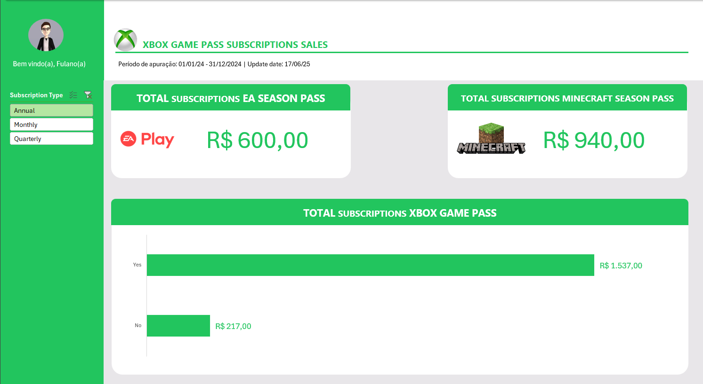

# 📊 Dashboard de Vendas em Excel

Este projeto tem como objetivo a criação de um **dashboard de vendas** no Microsoft Excel, transformando dados brutos em informações visuais e organizadas. A ferramenta permite análise clara de desempenho e auxilia na **tomada de decisões baseadas em dados**.

---

## 🎯 Objetivo do Projeto

Construir um dashboard funcional e interativo no Excel que:

- Organize e filtre os dados de vendas de forma dinâmica.
- Apresente gráficos e indicadores visuais que facilitam a interpretação.
- Permita uma análise eficiente dos resultados e apoio à tomada de decisão.

---

## 📁 Arquivo Disponível

➡️ [Clique para baixar o arquivo Excel com o dashboard](./Dashboard_Vendas.xlsx)

---

## 🧪 Dados Utilizados

Os dados simulam um cenário real de vendas e contêm as seguintes colunas:

- Data da Venda  
- Nome do Vendedor  
- Produto  
- Quantidade  
- Valor Total da Venda  
- Região  

Essas informações foram tratadas, organizadas em tabelas dinâmicas e conectadas a gráficos de análise.

---

## 🖼️ Visualizações

### Exemplo do Dashboard:

- 

---

## 🛠️ Como Reproduzir

1. Baixe o arquivo `Dashboard_Vendas.xlsx`.
2. Abra no Microsoft Excel (preferencialmente versão 2016 ou superior).
3. Navegue pelas abas e explore os gráficos interativos.
4. Caso queira aplicar seus próprios dados, substitua a base mantendo a estrutura.

---

## 📌 Conclusão

Este projeto demonstra a aplicação prática de conceitos de **análise de dados e visualização em Excel**, sendo uma ferramenta útil para análise comercial e acompanhamento de desempenho.

---

## 📜 Licença

Este projeto é de uso educacional e pessoal. Fique à vontade para adaptar e aprimorar conforme suas necessidades.
